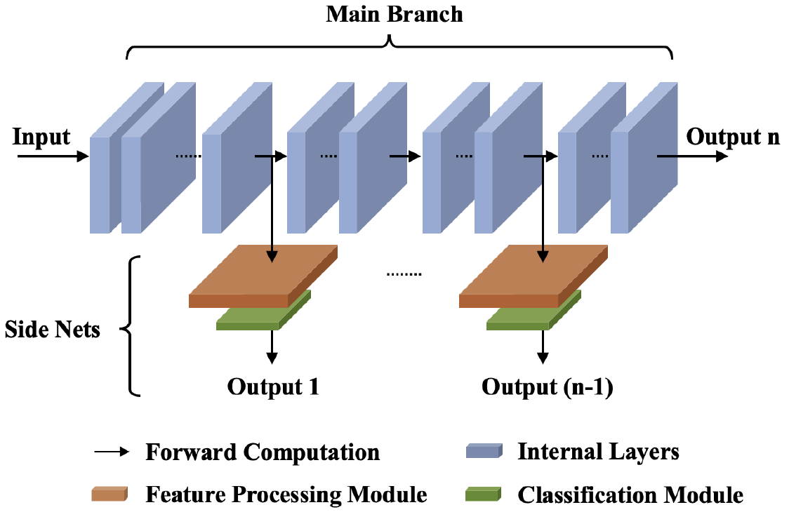

# Orion
Pytorch implementation of 2023 IJCAI paper "Orion: Online Backdoor Sample Detection via Evolution Deviance"  https://www.ijcai.org/proceedings/2023/96



## Requirements:

>pip install -r requirements.txt


## Data:
- `CIFAR10`: CIFAR-10 will be downloaded automatically   
  
- `TinyImagenet`: Download TinyImageNet from https://tiny-imagenet.herokuapp.com/, place it under data/ and use data.py - create_val_folder() to generate proper directory structure
  
- `GTSRB`: Download GTSRB from http://benchmark.ini.rub.de/?section=gtsrb&subsection=dataset#Downloads and crop out the ROI region.


## Usage

Train side nets
```
python train_networks.py --dataset cifar10 --struct vgg --bdmodel_path $backdoored_model_path --bdmodel_name $backdoored_model_name --sdmodel_name $saved_model_name --c_ratio 0.1
```

Poisoned data generation. See data.py
```
# $ATTACK_TYPE = ['BadNets', 'Blended', 'SIG', 'WaNet', 'IAD', 'ISSBA', 'TaCT']
import aux_funcs  as af
dataset = af.get_dataset('cifar10', add_trigger=True, attack_type=$ATTACK_TYPE)
clean_dataset = dataset.testset #clean test set
poisoned_dataset = dataset.only_trigger_test_set #poisoned test set(without target label)
```

Compute outlier score and identify poisoned indices
```
python confusion_experiments_bd.py
```

Clean label recovery experiment
```
python clean_recovery.py
```

## Reference
The attacks are mainly implemented according to [BackdoorBox](https://github.com/THUYimingLi/BackdoorBox).
